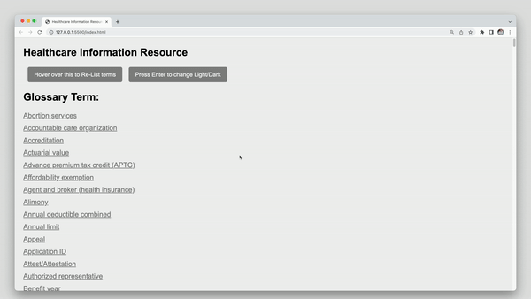

# Healthcare.gov Explanation Glossary

## Description

The Healthcare.gov Explanation Glossary is a web application that allows users to view and fetch healthcare glossary terms from a server. It provides a user-friendly interface to access definitions and related information about various healthcare terms.

## Installation

To run the application locally, follow these steps:

1. Fork and clone the repository: https://github.com/petemignin/Healthcare.gov-Explanation-Tool
2. Navigate to the project directory.
3. Install the json-server to mock an external API: `$ npm install -g json-server`
4. Then run the server with: `$ json-server db.json`
5. The application will be running on `http://localhost:3000`

## Usage

1. Open the application in your web browser.
2. Click on a term from the list to view its explanation and related information.
3. A Healthcare.gov URL is shown below the explanation information section if you want to click it to open the official Healthcare.gov website in a new teb.
4. Hover your mouse over the  "Re-List Terms" box to display all the glossary terms after you have read a certain one.
5. There is also a "dark mode" option that will allow you to toggle between a "light" and "dark" theme.  Press the enter key on your keyboard to toggle between the two modes. 
6. Demo video: https://youtu.be/1RrUuoyVCFA

## Technologies Used

- HTML
- CSS
- JavaScript
- Fetch API
- JSON-server (docs: https://www.npmjs.com/package/json-server)

## API Endpoint

The application fetches glossary terms from the following API endpoint:

- Endpoint: `http://localhost:3000/glossary`
- Method: GET
- Response: Array of glossary term objects

Each glossary term object has the following properties:

- `date`(string): The date 
- `tags` [array] a string inside of it
- `categories` [array] a string inside of it
- `title` (string): The title of the term
- `content` (string): The definition or explanation of the term
- `url` (string): The URL containing additional information about the term
- `lang` (string): Language
- `layout` (string)

## Contributing

Contributions are welcome! If you have any suggestions, bug reports, or feature requests, please open an issue on https://github.com/petemignin/Healthcare.gov-Explanation-Tool.

## License

## Project Status

This project is currently under active development. Future updates may include additional features and improvements to the user interface.
